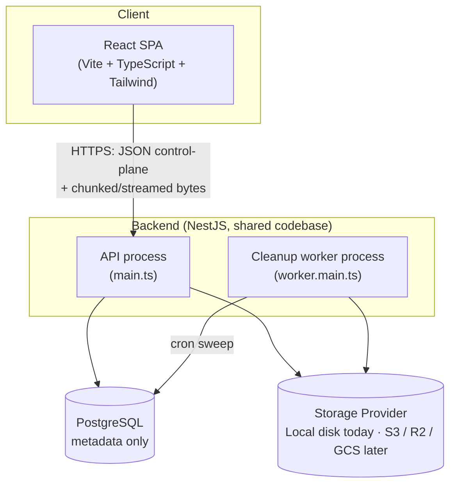
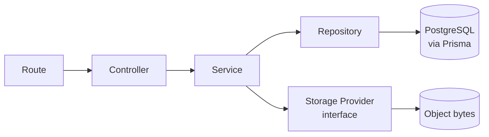
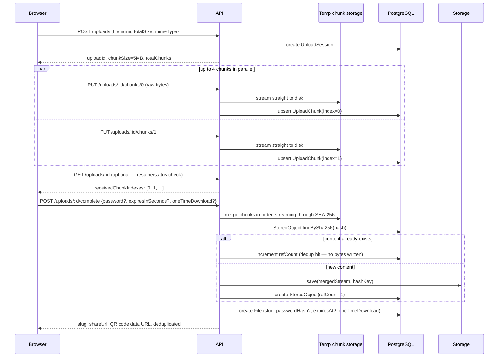
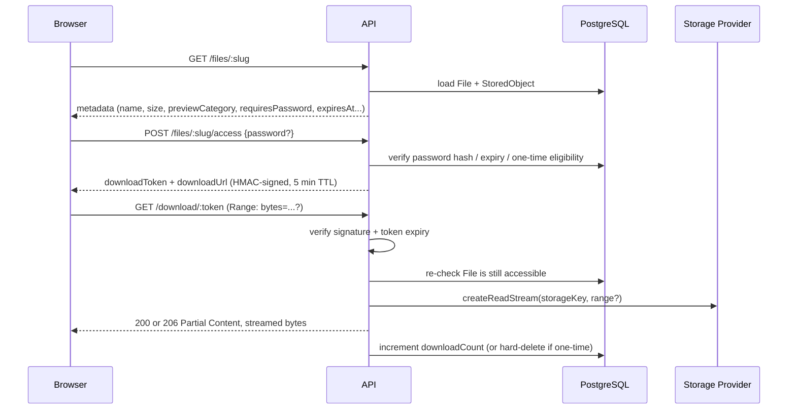
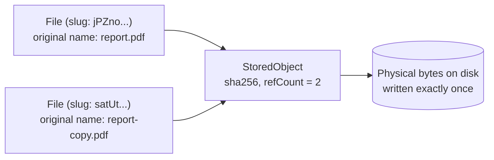
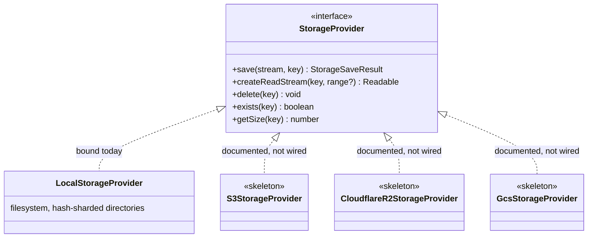
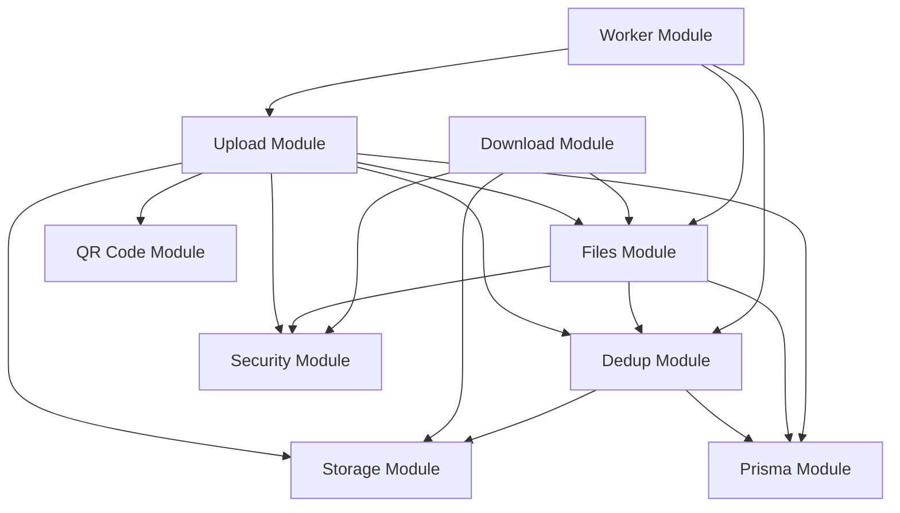

# ShareFlow

**A secure, production-grade file sharing platform** — chunked resumable uploads up to 2GB, streaming downloads, content-addressed deduplication, expiring/password-protected/one-time share links, and a storage layer that swaps from local disk to Cloudflare R2, Backblaze B2, or Amazon S3 without touching business logic.

No accounts. No login. Just a link.

---

## Table of Contents

- [Overview](#overview)
- [Features](#features)
- [Architecture](#architecture)
  - [High-Level Architecture](#high-level-architecture)
  - [Layered Request Flow](#layered-request-flow)
  - [Chunked Upload Flow](#chunked-upload-flow)
  - [Download Flow (Signed URLs)](#download-flow-signed-urls)
  - [Deduplication](#deduplication)
  - [Storage Layer](#storage-layer)
  - [Backend Module Graph](#backend-module-graph)
- [Folder Structure](#folder-structure)
- [Technology Stack](#technology-stack)
- [Design Decisions](#design-decisions)
- [Security](#security)
- [Performance](#performance)
- [Future Improvements](#future-improvements)
- [Setup Instructions](#setup-instructions)
- [API Documentation](#api-documentation)
- [Screenshots](#screenshots)
- [License](#license)

---

## Overview

ShareFlow is a self-hosted alternative to WeTransfer/Firefox Send-style file sharing: drop a file (or several), get back a secure link, optionally lock it with a password, an expiry, or a one-time-download rule. The point of this project isn't the feature list — it's demonstrating how each feature is *actually engineered*: files are streamed in 5MB chunks so a 2GB upload never sits in RAM, identical content is stored exactly once no matter how many people upload it, share links are unguessable, download URLs are cryptographically signed and short-lived, and a background worker quietly reclaims everything that expires.

It is built as a monorepo with a NestJS API, a React/TypeScript frontend, PostgreSQL for metadata only, and a storage abstraction that currently targets the local filesystem but is designed to move to S3/Cloudflare R2/GCS by changing a single dependency-injection binding.

## Features

| Feature | Details |
|---|---|
| **Drag & drop uploads** | Multi-file, file-picker or drag/drop, per-file progress |
| **Chunked uploads** | Files are split into 5MB chunks client-side; the server merges them — no single request ever carries a whole 2GB file |
| **Resumable / parallel uploads** | Up to 4 chunks in flight at once; if the browser is closed mid-upload, resuming re-syncs against the server's own record of which chunks arrived |
| **Streaming downloads** | Bytes are piped from disk straight to the HTTP response — the server never buffers a full file in memory |
| **HTTP Range support** | `206 Partial Content`, resumable downloads, video/audio seeking |
| **Secure share links** | 21-character non-sequential slugs (~124 bits of entropy) — nothing about `/f/jPZnozyyfsEp3Efp5wW6E` reveals how many files exist |
| **Password protection** | Optional per-link password, hashed with argon2id — never stored or logged in plaintext |
| **Expiring links** | 1 hour / 1 day / 7 days / custom (up to 30 days); expired links return `410 Gone` |
| **One-time download** | File and its metadata are deleted immediately after the first successful download |
| **Download counter** | Total downloads and last-download timestamp, shown on the download page |
| **QR codes** | Generated server-side for every completed upload |
| **File preview** | Inline preview for images, PDF, video, and audio; anything else falls back to a plain download |
| **Deduplication** | SHA-256 content hashing — re-uploading identical bytes creates a new share link but writes zero new bytes to storage |
| **Signed download URLs** | Byte-serving is gated by a short-lived (5 min) HMAC-signed token, decoupled from the long-lived share link |
| **Storage abstraction** | `StorageProvider` interface; local disk today, S3/R2/GCS are a DI binding away |
| **Background cleanup worker** | Purges expired/consumed files, abandoned upload sessions, and orphaned storage objects on a cron schedule |
| **Rate limiting** | Configurable per-route limits (uploads and downloads throttled independently, per IP) |
| **Dark mode** | Persisted, respects OS preference on first visit |
| **Local upload history** | "Your recent uploads on this device" — a `localStorage`-only convenience, never sent to the server |

## Architecture

### High-Level Architecture



The API and the worker are **two entrypoints of the same NestJS codebase** (`src/main.ts` vs `src/worker.main.ts`), not two separate apps — they share every service, repository, and the storage abstraction, and are deployed as separate containers so the worker can be scaled or restarted independently of request traffic.

### Layered Request Flow

Every feature module follows the same layering, and it is enforced structurally (by what each class is allowed to import), not just by convention:



- **Controllers** only translate HTTP ⇄ DTOs. No business logic.
- **Services** hold all business rules (validation beyond shape, access control, dedup logic, token issuance).
- **Repositories** are the only classes that import `PrismaService` — they translate between Prisma's row shape (e.g. `BigInt` sizes) and plain application types.
- **Storage Provider** is an interface; nothing outside `modules/storage` ever calls `fs` directly.

### Chunked Upload Flow



Chunk PUTs bypass Nest's global JSON body parser entirely (see `AppModule#configure`) — the raw request stream is piped directly to a write stream, so a chunk is never materialized as an in-memory `Buffer`.

### Download Flow (Signed URLs)



The share link (`/f/:slug`) and the download link (`/download/:token`) are **deliberately different endpoints with different lifetimes**: the slug is long-lived and is where password/expiry/one-time rules are enforced; the token is short-lived and does no business-rule checking beyond "is this signature valid and not expired." See [Design Decisions](#design-decisions) for the reasoning.

### Deduplication



Two uploads with identical content produce two `File` rows (two independent share links, each with its own password/expiry/one-time settings) pointing at **one** `StoredObject`. `refCount` tracks how many `File` rows reference it; physical bytes are deleted only when `refCount` reaches zero.

### Storage Layer



`StorageModule` binds the `STORAGE_PROVIDER` DI token to `LocalStorageProvider`. The other three classes exist in the repo (`src/modules/storage/providers/`) with full doc comments describing exactly which SDK calls each method maps to — they're intentionally not wired in, so the swap-in checklist for a real cloud backend is visible without adding cloud SDKs (and their credentials/config surface) to a project that runs entirely locally by default.

### Backend Module Graph



## Folder Structure

```
ShareFlow/
├── apps/
│   ├── api/                      NestJS backend
│   │   ├── src/
│   │   │   ├── modules/
│   │   │   │   ├── upload/       Chunk session init/status/PUT/complete
│   │   │   │   ├── files/        Share-link metadata, password/expiry access checks
│   │   │   │   ├── download/     Signed-token verification + range-aware streaming
│   │   │   │   ├── dedup/        StoredObject repository + service (hash lookup, refcount)
│   │   │   │   ├── storage/      StorageProvider interface, LocalStorageProvider, S3/R2/GCS skeletons
│   │   │   │   ├── security/     Password hashing, signed tokens, filename sanitization, MIME sniffing
│   │   │   │   ├── qrcode/       QR code generation
│   │   │   │   ├── worker/       CleanupService (cron jobs)
│   │   │   │   └── prisma/       PrismaService/module
│   │   │   ├── common/filters/   Centralized exception filter
│   │   │   ├── config/           Env validation, configuration loader, decorator-safe constants
│   │   │   ├── app.module.ts     HTTP app wiring (guards, filters, middleware)
│   │   │   ├── main.ts           API process entrypoint
│   │   │   └── worker.main.ts    Cleanup worker process entrypoint
│   │   ├── prisma/               schema.prisma + migrations
│   │   ├── test/                 Integration (e2e/supertest) tests
│   │   └── Dockerfile
│   └── web/                      React frontend
│       ├── src/
│       │   ├── api/              Typed fetch client (+ XHR for chunk upload progress)
│       │   ├── components/       upload/ · share/ · download/ · layout/
│       │   ├── hooks/            useChunkedUpload, useLocalUploadHistory, useTheme
│       │   ├── lib/               Pure helpers: chunk math, concurrency pool, byte formatting
│       │   └── pages/             UploadPage, DownloadPage, NotFoundPage
│       ├── Dockerfile
│       └── nginx.conf
├── packages/
│   └── shared/                   TS types/DTOs/constants shared by both apps (dual CJS+ESM build)
├── data/                         gitignored local storage root + Postgres volume mount target (dev)
├── docker-compose.yml
├── .env.example
└── pnpm-workspace.yaml
```

## Technology Stack

### Backend

**NestJS**
> Purpose: Application framework for the API and worker.
> Reason: First-class dependency injection, module boundaries, and built-in guards/interceptors/pipes map almost 1:1 onto the required Controller → Service → Repository → Storage layering — the architecture is visible in the code structure, not just asserted in a diagram. `@nestjs/throttler` and `@nestjs/schedule` cover rate limiting and cron scheduling without extra infrastructure.

**TypeScript**
> Purpose: Static typing across the entire stack.
> Reason: A file-sharing platform's correctness hinges on exact byte-range math, DTO shapes crossing the network boundary, and Prisma's `BigInt` vs `number` boundary — all places where a type system catches real bugs before runtime.

**PostgreSQL**
> Purpose: Metadata storage only (never file bytes).
> Reason: Relational integrity (foreign keys between `File` and `StoredObject`) and transactional guarantees around reference counting matter more here than schema flexibility. It's a well-understood, horizontally-provable choice for a metadata store that needs to survive concurrent writers safely.

**Prisma**
> Purpose: Database ORM and migration tool.
> Reason: Type-safe queries generated from a single schema file, first-class migration history, and a query API that makes the reference-counting logic (`increment`/`decrement` atomics) straightforward to write correctly.

**argon2 (argon2id)**
> Purpose: Password hashing for password-protected share links.
> Reason: The current OWASP-recommended algorithm — memory-hard, which makes GPU/ASIC brute-forcing meaningfully more expensive than bcrypt for the same computational budget.

**Helmet**
> Purpose: Sets security-related HTTP response headers.
> Reason: One-line defense against a class of header-based attacks (clickjacking, MIME sniffing, etc.) with sane defaults for an API that also serves files.

**class-validator / class-transformer**
> Purpose: DTO validation and transformation.
> Reason: Declarative validation co-located with the DTO shape itself, integrated with Nest's `ValidationPipe` — every request is validated before it reaches a controller method.

**nanoid**
> Purpose: Share-slug generation.
> Reason: Cryptographically strong random ID generation with a configurable alphabet — used here with an alphabet that excludes visually ambiguous characters (`0/O`, `1/l/I`), since links are sometimes typed or read aloud.

**qrcode**
> Purpose: Server-side QR code generation for share links.
> Reason: Generating the QR code server-side (returned as a data URL) means the frontend needs zero QR-rendering logic or extra dependency.

**file-type**
> Purpose: Magic-byte MIME sniffing.
> Reason: Client-supplied `Content-Type` and filename extensions are trivially spoofable; deciding what's previewable (and what the `Content-Type` response header should be) from the actual file bytes is the only trustworthy signal.

### Frontend

**React + TypeScript**
> Purpose: UI framework and type safety for the client.
> Reason: Component-driven UI for a page with real interactive complexity (chunked upload state machine, live countdowns, conditional password prompts) — TypeScript keeps the shared DTO shapes (via `@shareflow/shared`) honest across the network boundary.

**Vite**
> Purpose: Frontend build tool and dev server.
> Reason: Near-instant HMR during development and a fast, simple production build — no webpack configuration to maintain for a project this size.

**Tailwind CSS**
> Purpose: Utility-first styling.
> Reason: Fast to build a consistent, professional UI without hand-rolling a component library, with first-class dark-mode support via the `class` strategy used here.

**TanStack Query (React Query)**
> Purpose: Server-state management for the download page (metadata fetch, access-token mutation).
> Reason: Handles loading/error/retry state declaratively instead of hand-rolled `useEffect` + `useState` chains, and de-duplicates in-flight requests for free.

**React Router**
> Purpose: Client-side routing (`/` upload page, `/f/:slug` download page).
> Reason: The standard, well-understood router for a small number of routes with a dynamic segment.

### Infrastructure

**Docker & Docker Compose**
> Purpose: Containerized local development and deployment.
> Reason: `docker compose up --build` brings up Postgres, the API, the worker, and the web app with one command — no "works on my machine" setup steps for a reviewer to fight through.

**pnpm workspaces**
> Purpose: Monorepo package management.
> Reason: Strict, non-hoisted `node_modules` (catches accidental phantom-dependency bugs — this project hit and fixed one, see `express` in `apps/api/package.json`) and fast, disk-efficient installs via content-addressed storage.

## Design Decisions

**Why chunk uploads instead of one request per file?**
A single 2GB request is fragile — one dropped connection loses the whole upload, and many reverse proxies/load balancers have far smaller default body-size limits than 2GB. Splitting into 5MB chunks bounds the blast radius of a failure to one chunk, enables genuine parallelism (up to 4 chunks in flight), and makes resumability possible: the server tracks exactly which chunk indexes it has received, so a client can ask "what's missing?" instead of starting over.

**Why is the merge+hash step streaming instead of read-then-hash?**
`mergeChunksWithHash` (in `upload-merge.util.ts`) pipes each chunk's read stream through the SHA-256 hash *while* writing it to the merged file — one pass over the bytes produces both the merged file and its content hash. A naive implementation would write the file, then re-read the whole thing to hash it: twice the I/O for a 2GB file.

**Why SHA-256 for deduplication?**
It's cryptographically collision-resistant (accidental collisions are not a practical concern at any realistic upload volume), computed in one streaming pass with no extra dependency (Node's built-in `crypto`), and produces a fixed-length, URL/filesystem-safe hex string that doubles as the storage key.

**Why PostgreSQL only for metadata?**
Storing file bytes in a relational database (as `bytea`/`large object`) bloats the database, complicates backups, and doesn't stream well. Keeping Postgres to rows-and-foreign-keys and delegating bytes to a purpose-built storage layer is what every real object-storage-backed system does — it's also what makes the storage layer swappable independently of the data model.

**Why a `StorageProvider` interface instead of calling `fs` directly?**
Because "swap local disk for S3 later" is a real, common evolution for a project like this, and retrofitting an abstraction after fifteen call sites already assume `fs.createReadStream` is far more error-prone than establishing the boundary from the start. The interface is narrow (five methods) specifically so implementing a new provider is a small, reviewable diff.

**Why decouple the share link from the download URL with a signed token?**
Two different lifetimes are being modeled: the share link (`/f/:slug`) is long-lived (hours to weeks) and is where password/expiry/one-time authorization happens. The download URL (`/download/:token`) is short-lived (5 minutes) and does no authorization of its own — it only verifies an HMAC signature and an expiry timestamp. This mirrors how S3 presigned URLs work, and the practical payoff is real: the byte-serving endpoint could be moved behind a CDN or a different origin entirely without touching a single line of password/expiry logic, because that logic never lived there.

**Why hand-roll the signed token instead of using a JWT library?**
The token has exactly one claim shape and one algorithm (HMAC-SHA256). A JWT library adds header/algorithm-negotiation surface area — the source of real-world vulnerabilities like `"alg": "none"` confusion — for a feature this project doesn't need. `SignedTokenService` is under 60 lines and uses `crypto.timingSafeEqual` for constant-time signature comparison.

**Why is the cleanup worker a separate process rather than an in-process cron in the API?**
Running cron jobs inside the same process that serves HTTP traffic means a slow cleanup pass (e.g., sweeping thousands of expired rows) can compete with request-handling for the event loop, and horizontally scaling the API (multiple replicas) would run the same cron job N times unless carefully coordinated. A separate `worker` process/container runs one cron schedule regardless of how many API replicas exist, and can be scaled or restarted independently.

**Why Docker for local development, not just `pnpm dev`?**
Because "start Postgres, run migrations, start the API, start the worker, start the frontend, get the env vars right across all four" is exactly the kind of multi-step setup that makes a project hard for someone else to evaluate. `docker compose up --build` collapses that to one command and one `.env` file.

## Security

- **Password hashing** — argon2id, never bcrypt/plaintext; a malformed stored hash is treated as a failed match rather than crashing the request.
- **Signed, tamper-proof download URLs** — HMAC-SHA256 over the payload, verified with a constant-time comparison (`crypto.timingSafeEqual`) to prevent timing side-channels; a modified payload byte invalidates the signature.
- **Non-sequential share links** — 21-character nanoid slugs from a 58-character alphabet (~124 bits of entropy); no auto-increment ID that leaks how many files exist or lets one guess adjacent files.
- **Directory-traversal protection** — every storage key is validated (`assertSafeObjectKey`) and every resolved path is checked to stay inside the storage root before any filesystem operation; storage keys are always server-derived from a SHA-256 hash, never taken from user input.
- **Secure filename handling** — the *display* filename (used in `Content-Disposition` and shown in the UI) is sanitized independently of the *storage* key, which is always content-derived — a malicious filename can never influence where bytes land on disk.
- **MIME verification via magic bytes** — `file-type` sniffs the real content type from file bytes rather than trusting the client's `Content-Type` header or filename extension.
- **Configurable CORS** — explicit origin allowlist via `CORS_ORIGINS`, not a wildcard.
- **Helmet** — standard security headers (CSP, `X-Content-Type-Options`, `X-Frame-Options`, etc.) on every response.
- **Centralized exception handling** — a single `HttpExceptionFilter` maps every thrown error to a consistent JSON shape and the correct HTTP status; unexpected (non-`HttpException`) errors are logged server-side but never leak stack traces or internal details to the client.
- **Strict request validation** — a global `ValidationPipe` with `whitelist: true, forbidNonWhitelisted: true` rejects any request body containing fields outside the declared DTO shape.
- **Chunk integrity checks** — declared `Content-Length` is cross-checked against the expected chunk size for that index, and actual bytes received are capped mid-stream (protecting against a client lying about or omitting the header); a chunk that's the wrong size is rejected and its partial write cleaned up.
- **One-time downloads never honor Range requests** — a partial-byte probe (e.g. a media player reading the first few KB) cannot silently consume a one-time-download file; only a full, complete response triggers deletion.
- **Rate limiting** — per-route, per-IP limits (uploads and downloads throttled independently) via `@nestjs/throttler`.

## Performance

- **Streaming, not buffering** — both the upload merge step and every download response operate on Node streams end-to-end. A 2GB file download never exists as a single in-memory `Buffer`; peak memory usage is bounded by the internal stream highWaterMark (a few dozen KB), not by file size.
- **Chunked, parallel uploads** — 5MB chunks with up to 4 concurrent in-flight requests saturate available bandwidth better than one giant sequential request, and bound retry cost to a single chunk on failure.
- **HTTP Range support** — enables true resumable downloads and lets video/audio elements seek without re-downloading the whole file.
- **Deduplication** — identical content is written to disk exactly once regardless of how many times it's uploaded; a second upload of the same bytes is nearly free (a hash comparison and a DB row insert, no I/O to the storage backend).
- **Hash-sharded storage keys** — objects are stored under two levels of two-character hash-prefix directories (e.g. `b7/20/b720...`), avoiding the performance cliff of millions of files in one flat directory on typical filesystems.
- **Independent rate-limit buckets** — upload and download traffic are throttled separately, so a burst of downloads can't starve upload capacity or vice versa.
- **Horizontally scalable by design** — the API is stateless (all state lives in Postgres and the storage backend), so running multiple API replicas behind a load balancer requires no code changes; the worker is a single separate process specifically so cron jobs aren't duplicated per replica.

## Future Improvements

Realistic next steps for taking this from a portfolio project to a production deployment:

- **Wire up a real cloud `StorageProvider`** (S3, Cloudflare R2, or GCS) — the skeleton classes and swap-in checklist already exist in `src/modules/storage/providers/`.
- **CDN in front of the download endpoint** — the signed-URL design was chosen specifically so this doesn't require touching authorization logic.
- **Redis-backed rate limiting and caching** — the current in-memory `ThrottlerModule` storage resets on restart and doesn't coordinate across multiple API replicas; a Redis store fixes both.
- **Optional authentication** — accounts would enable a real "my files" dashboard (server-side, not just the current `localStorage` convenience list), manual link revocation, and per-user quotas.
- **Virus/malware scanning** — pipe uploaded content through ClamAV or a cloud scanning API before a share link becomes active.
- **True cross-session resumable uploads** — persisting chunk state (and ideally the file handle via the File System Access API) so an upload can resume after a full browser restart, not just a pause within the same tab session.
- **Multi-region storage replication** and **object storage lifecycle policies** (auto-archival of rarely-accessed objects to cold storage tiers).
- **Observability** — structured logging, request tracing, and metrics (upload/download volume, dedup hit rate, storage growth) exported to Prometheus/Grafana or similar.
- **End-to-end encryption** — client-side encryption before upload, with the decryption key embedded in the share link fragment (never sent to the server) for a true zero-knowledge sharing mode.
- **Email/webhook notifications** on file access, for senders who want to know when a recipient has downloaded.

## Setup Instructions

### Prerequisites

- Node.js 20+
- pnpm 9+ (`corepack enable && corepack prepare pnpm@9 --activate`)
- PostgreSQL 16 (local install) **or** Docker — pick one path below

### Option A — Docker (recommended, one command)

```bash
cp .env.example .env
# edit .env and set APP_SECRET, e.g.:
# APP_SECRET=$(openssl rand -hex 32)

docker compose up --build
```

This starts Postgres, the API (running migrations automatically on boot), the cleanup worker, and the web app.

- Web app: http://localhost:5173
- API: http://localhost:4000

### Option B — Local development

```bash
# 1. Install dependencies
corepack enable
pnpm install

# 2. Start PostgreSQL (however you prefer — Homebrew, Docker, etc.)
#    then create a database, e.g.:
createdb shareflow_dev

# 3. Configure environment variables
cp apps/api/.env.example apps/api/.env   # edit DATABASE_URL, APP_SECRET, etc.
cp apps/web/.env.example apps/web/.env

# 4. Run database migrations
pnpm --filter @shareflow/api prisma:migrate

# 5. Build the shared types package (both apps depend on it)
pnpm --filter @shareflow/shared build

# 6. Start the API, worker, and web app in separate terminals
pnpm --filter @shareflow/api start:dev
pnpm --filter @shareflow/api start:worker:dev
pnpm --filter @shareflow/web dev
```

### Environment Variables

See `.env.example` (root, for Docker) and `apps/api/.env.example` / `apps/web/.env.example` (for local dev) for the full list. Key variables:

| Variable | Where | Purpose |
|---|---|---|
| `DATABASE_URL` | api | PostgreSQL connection string |
| `APP_SECRET` | api | HMAC secret for signed download tokens — **required**, generate with `openssl rand -hex 32` |
| `PUBLIC_APP_URL` | api | Frontend origin, used to build share links |
| `PUBLIC_API_URL` | api | API origin, used to build download URLs |
| `CORS_ORIGINS` | api | Comma-separated allowlist of origins permitted to call the API |
| `UPLOAD_RATE_LIMIT_PER_HOUR` | api | Per-IP upload-session limit (default 100) |
| `DOWNLOAD_RATE_LIMIT_PER_HOUR` | api | Per-IP download limit (default 300) |
| `CLEANUP_CRON_INTERVAL_MINUTES` | api/worker | How often the cleanup worker runs (default 15) |
| `VITE_API_BASE_URL` | web | API origin the frontend calls — baked in at **build** time (Vite), not runtime |

### Running Tests

```bash
# Backend unit tests
pnpm --filter @shareflow/api test

# Backend integration tests (needs a running Postgres — see below)
createdb shareflow_test
pnpm --filter @shareflow/api test:e2e

# Frontend tests
pnpm --filter @shareflow/web test
```

Integration tests read `DATABASE_URL` from `test/setup-e2e.ts`, defaulting to a local `shareflow_test` database (override with `TEST_DATABASE_URL`). They run with `--runInBand` since multiple spec files share one database.

## API Documentation

All endpoints return JSON except `GET /download/:token`, which streams file bytes. Errors follow a consistent shape:

```json
{
  "statusCode": 404,
  "message": "This share link does not exist.",
  "error": "Not Found",
  "timestamp": "2026-07-09T09:23:48.021Z",
  "path": "/files/does-not-exist"
}
```

### `POST /uploads`

Starts a chunked upload session.

**Request**
```json
{ "filename": "vacation.mp4", "totalSize": 52428800, "mimeType": "video/mp4" }
```

**Response** `201`
```json
{ "uploadId": "f92e66fe-3277-4ceb-a2fd-097a6742e425", "chunkSize": 5242880, "totalChunks": 10 }
```

**Errors**: `400` invalid/oversized (`totalSize` > 2GB) or malformed request · `429` rate limit exceeded

---

### `GET /uploads/:id`

Returns which chunks the server has already received — used for resuming an interrupted upload.

**Response** `200`
```json
{ "uploadId": "f92e66fe-...", "status": "PENDING", "totalChunks": 10, "receivedChunkIndexes": [0, 1, 2] }
```

**Errors**: `404` unknown upload session

---

### `PUT /uploads/:id/chunks/:index`

Uploads one chunk. Body is the raw chunk bytes (`Content-Type: application/octet-stream`), not JSON. Idempotent — re-uploading the same index overwrites it, which is what makes retries and resumption safe.

**Response** `200`
```json
{ "chunkIndex": 3, "received": true }
```

**Errors**: `400` invalid chunk index, or actual bytes don't match the expected size for that index · `410` upload session expired (24h TTL) · `413` chunk exceeds the expected size · `429` rate limit exceeded

---

### `POST /uploads/:id/complete`

Merges all chunks, computes the SHA-256 hash, deduplicates against existing content, and creates the share link.

**Request** (all fields optional)
```json
{ "password": "hunter2", "expiresInSeconds": 86400, "oneTimeDownload": false }
```

**Response** `201`
```json
{
  "slug": "jPZnozyyfsEp3Efp5wW6E",
  "shareUrl": "http://localhost:5173/f/jPZnozyyfsEp3Efp5wW6E",
  "qrCodeDataUrl": "data:image/png;base64,...",
  "deduplicated": false
}
```

**Errors**: `400` missing chunks, or merged size doesn't match the declared `totalSize` · `404` unknown upload session · `410` upload session expired

---

### `GET /files/:slug`

Public share-link metadata. Does **not** require a password — the password only gates access to the actual download token.

**Response** `200`
```json
{
  "slug": "jPZnozyyfsEp3Efp5wW6E",
  "originalFilename": "vacation.mp4",
  "size": 52428800,
  "mimeType": "video/mp4",
  "previewCategory": "video",
  "requiresPassword": false,
  "oneTimeDownload": false,
  "expiresAt": "2026-07-10T09:22:37.027Z",
  "downloadCount": 0,
  "lastDownloadAt": null,
  "createdAt": "2026-07-09T09:22:37.035Z"
}
```

**Errors**: `404` link never existed · `410` expired, already consumed (one-time), or removed

---

### `POST /files/:slug/access`

Validates the password (if any) and issues a short-lived signed download token.

**Request**
```json
{ "password": "hunter2" }
```

**Response** `200`
```json
{
  "downloadToken": "eyJmaWxlSWQ...signature",
  "downloadUrl": "http://localhost:4000/download/eyJmaWxlSWQ...signature",
  "expiresAt": "2026-07-09T09:27:48.494Z"
}
```

**Errors**: `401` missing/incorrect password · `404` link never existed · `410` expired or already consumed

---

### `GET /download/:token`

Streams the file. Supports `Range` requests (except for one-time-download files, which always serve the full file so a partial read can't consume a one-time link).

**Request headers** (optional): `Range: bytes=0-1023`

**Response**: `200` (full file) or `206 Partial Content` (range), with `Content-Type`, `Content-Disposition`, `Content-Length`, and (for ranges) `Content-Range` set appropriately.

**Errors**: `401` invalid/tampered token · `410` token expired, or the underlying file became inaccessible since the token was issued · `416` unsatisfiable range · `429` rate limit exceeded

## Screenshots

> _Add screenshots here before publishing — suggested set:_
> - Upload page (empty state, drag-over state)
> - Upload in progress (multi-file, per-file progress bars)
> - Share link result panel with QR code expanded
> - Download page: image/video/PDF preview
> - Download page: password prompt
> - Dark mode variants of the above

## License

[MIT](./LICENSE)
